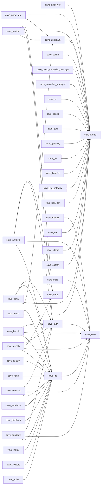

# Cross-crate dependency chain — `cave-runtime` workspace

**Generated:** 2026-05-24T20:16:18Z  
**Source:** `cargo metadata --no-deps` (kind ≠ dev)  
**Workspace packages:** 112  
**Intra-workspace edges (non-dev):** 136  
**Dev-dep edges:** 0

This document is regenerated from `cargo metadata` on every
doc-sync pass. The Mermaid diagram below shows only the
foundation layer (crates with ≥ 3 inbound non-dev deps); the
appendix carries the full edge list.

## Top-degree summary

### Most depended-upon crates (foundations)

| Crate | Inbound edges (non-dev) |
|-------|------------------------:|
| `cave-kernel` | 20 |
| `cave-db` | 14 |
| `cave-core` | 9 |
| `cave-auth` | 7 |
| `cave-certs` | 3 |
| `cave-upstream` | 3 |
| `cave-artifacts` | 2 |
| `cave-etcd` | 2 |
| `cave-portal` | 2 |
| `cave-scan` | 2 |
| `cave-acme` | 1 |
| `cave-admission` | 1 |
| `cave-ai-obs` | 1 |
| `cave-alerts` | 1 |
| `cave-apiserver` | 1 |

### Crates with the largest fan-out (consumers / orchestrators)

| Crate | Outbound edges (non-dev) |
|-------|-------------------------:|
| `cave-runtime` | 75 |
| `cave-artifacts` | 5 |
| `cave-identity` | 5 |
| `cave-portal` | 5 |
| `cave-bench` | 3 |
| `cave-forensics` | 3 |
| `cave-portal-api` | 3 |
| `cave-sandbox` | 3 |
| `cave-apiserver` | 2 |
| `cave-mesh` | 2 |
| `cavectl` | 2 |
| `cave-auth` | 1 |
| `cave-cache` | 1 |
| `cave-certs` | 1 |
| `cave-cloud-controller-manager` | 1 |

## Foundation layer — Mermaid



## Full intra-workspace edge list (non-dev)

```text
cave-apiserver -> cave-etcd
cave-apiserver -> cave-kernel
cave-artifacts -> cave-auth
cave-artifacts -> cave-certs
cave-artifacts -> cave-core
cave-artifacts -> cave-db
cave-artifacts -> cave-scan
cave-auth -> cave-core
cave-bench -> cave-auth
cave-bench -> cave-core
cave-bench -> cave-db
cave-cache -> cave-kernel
cave-certs -> cave-acme
cave-cloud-controller-manager -> cave-kernel
cave-controller-manager -> cave-kernel
cave-cri -> cave-kernel
cave-db -> cave-core
cave-deploy -> cave-db
cave-docdb -> cave-kernel
cave-etcd -> cave-kernel
cave-flags -> cave-db
cave-forensics -> cave-auth
cave-forensics -> cave-core
cave-forensics -> cave-db
cave-gateway -> cave-kernel
cave-ha -> cave-kernel
cave-identity -> cave-auth
cave-identity -> cave-certs
cave-identity -> cave-core
cave-identity -> cave-db
cave-identity -> cave-pki
cave-incidents -> cave-db
cave-kubelet -> cave-kernel
cave-llm-gateway -> cave-kernel
cave-local-llm -> cave-kernel
cave-mesh -> cave-db
cave-mesh -> cave-kernel
cave-metrics -> cave-core
cave-net -> cave-kernel
cave-pipelines -> cave-db
cave-policy -> cave-db
cave-portal -> cave-auth
cave-portal -> cave-db
cave-portal -> cave-kernel
cave-portal -> cave-upstream
cave-portal -> cave-upstream-watchd
cave-portal-api -> cave-kernel
cave-portal-api -> cave-portal
cave-portal-api -> cave-upstream
cave-rdbms -> cave-kernel
cave-registry -> cave-artifacts
cave-rollouts -> cave-db
cave-runtime -> cave-admission
cave-runtime -> cave-ai-obs
cave-runtime -> cave-alerts
cave-runtime -> cave-apiserver
cave-runtime -> cave-artifacts
cave-runtime -> cave-auth
cave-runtime -> cave-backup
cave-runtime -> cave-cache
cave-runtime -> cave-certs
cave-runtime -> cave-changelog
cave-runtime -> cave-chaos
cave-runtime -> cave-chat
cave-runtime -> cave-cloud-controller-manager
cave-runtime -> cave-cluster
cave-runtime -> cave-compliance
cave-runtime -> cave-container-scan
cave-runtime -> cave-controller-manager
cave-runtime -> cave-cost
cave-runtime -> cave-cost-alloc
cave-runtime -> cave-cri
cave-runtime -> cave-crm
cave-runtime -> cave-dashboard
cave-runtime -> cave-dast
cave-runtime -> cave-deploy
cave-runtime -> cave-devlake
cave-runtime -> cave-dns
cave-runtime -> cave-docdb
cave-runtime -> cave-docs
cave-runtime -> cave-docs-site
cave-runtime -> cave-erp
cave-runtime -> cave-etcd
cave-runtime -> cave-flags
cave-runtime -> cave-forensics
cave-runtime -> cave-gateway
cave-runtime -> cave-gitops-config
cave-runtime -> cave-incidents
cave-runtime -> cave-infra
cave-runtime -> cave-kamaji
cave-runtime -> cave-kernel
cave-runtime -> cave-kubelet
cave-runtime -> cave-lint
cave-runtime -> cave-llm-gateway
cave-runtime -> cave-logs
cave-runtime -> cave-mesh
cave-runtime -> cave-metrics
cave-runtime -> cave-net
cave-runtime -> cave-oncall
cave-runtime -> cave-pam
cave-runtime -> cave-pii
cave-runtime -> cave-pipelines
cave-runtime -> cave-policy
cave-runtime -> cave-portal
cave-runtime -> cave-profiler
cave-runtime -> cave-rdbms
cave-runtime -> cave-rdbms-operator
cave-runtime -> cave-rollouts
cave-runtime -> cave-runbook
cave-runtime -> cave-sbom
cave-runtime -> cave-scaffold
cave-runtime -> cave-scan
cave-runtime -> cave-scheduler
cave-runtime -> cave-secrets
cave-runtime -> cave-security
cave-runtime -> cave-sign
cave-runtime -> cave-slo
cave-runtime -> cave-status
cave-runtime -> cave-store
cave-runtime -> cave-streams
cave-runtime -> cave-trace
cave-runtime -> cave-tracker
cave-runtime -> cave-upstream
cave-runtime -> cave-uptime
cave-runtime -> cave-vault
cave-runtime -> cave-vulns
cave-runtime -> cave-workflows
cave-sandbox -> cave-auth
cave-sandbox -> cave-core
cave-sandbox -> cave-db
cave-search -> cave-kernel
cave-store -> cave-core
cave-upstream -> cave-kernel
cave-vulns -> cave-db
cavectl -> cave-bench
cavectl -> cave-falco
```

## Refresh

```bash
cd $(git rev-parse --show-toplevel)
cargo metadata --no-deps --format-version 1 > /tmp/cargo_meta.json
# regen via the doc-sync ray (see docs/refactor-sweep-2.5-doc-sync.md)
```
